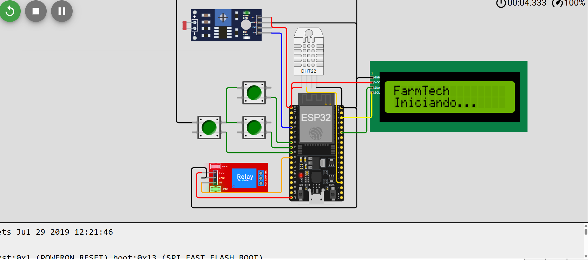
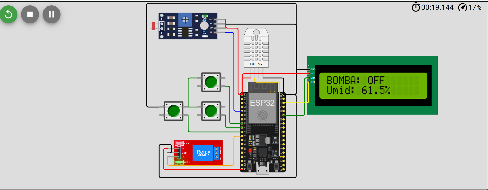
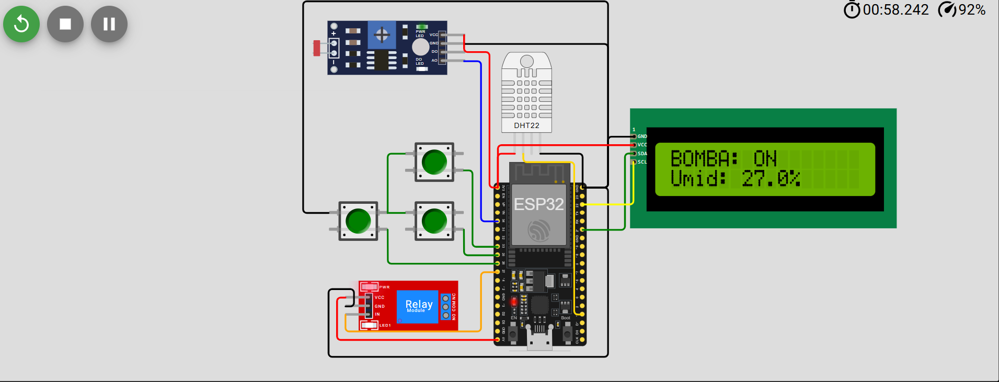

FarmTech Solutions — Irrigação Inteligente (Laranja)

Sistema didático de agricultura digital usando ESP32 no Wokwi:
    -Botões (N, P, K) simulam nutrientes.
    -Módulo LDR simula pH do solo (0–14).
    -DHT22 mede umidade (%) e temperatura (°C).
    -Relé (simulado) liga/desliga a bomba d’água.
    -LCD 16x2 I2C atua como “letreiro” (BOMBA: ON/OFF + umidade).

    -Cultura de referência: laranja — pH ideal ~5.8–7.0.
    -Histerese de umidade: liga < 45% e desliga ≥ 55%.
    -Emergências: seca extrema (< 35%) ou calor (≥ 40 °C).

1) Objetivo
Construir/simular um dispositivo IoT que decide quando ligar e desligar a irrigação de uma lavoura de laranja com base em:
    - níveis de N, P, K (botões),
    - pH do solo (LDR mapeado para 0..14),
    - Umidade (%) e Temperatura (°C) via DHT22.

2) Componentes
    -1× ESP32 DevKit
    -3× Botões (momentâneos) — N, P, K
    -1× Módulo LDR (photoresistor com AO/DO)
    -1× DHT22 (umidade/temperatura)
    -1× Módulo de Relé 1 canal (entrada IN)
    -1× LCD 16x2 I2C (endereço padrão 0x27, às vezes 0x3F)
    -Jumpers (vermelho = VCC; preto = GND; verde = dados; amarelo = clock/controle; laranja = atuador)

3) Bibliotecas (Wokwi/Arduino IDE)
    - DHT sensor library for ESPx
    - LiquidCrystal_I2C
    - Wire (nativa)

4) Ligações (pinos)

-----------------------------------------------------------------------------------------------------
Dispositivo	    Pino no módulo	                Pino ESP32	    Observação
-----------------------------------------------------------------------------------------------------
Botão N	        lado 1 → GND / lado 2 → sinal	GPIO 26	        INPUT_PULLUP (solto=1, pressionado=0)
-----------------------------------------------------------------------------------------------------
Botão P	        idem	                        GPIO 25	        〃
-----------------------------------------------------------------------------------------------------
Botão K	        idem	                        GPIO 33	        〃
-----------------------------------------------------------------------------------------------------
Módulo LDR	    VCC	                            3V3	            DO não usado
	            GND	                            GND	
	            AO	                            GPIO 34	        leitura analógica (ADC)
-----------------------------------------------------------------------------------------------------
DHT22	        VCC	                            3V3	            no Wokwi o DATA aparece como SDA
	            GND	                            GND	
	            DATA/SDA	                    GPIO 15	        umidade e temperatura
-----------------------------------------------------------------------------------------------------
Relé 1ch	    VCC	                            5V	            muitos são ativo-LOW
	            GND	                            GND	
	            IN	                            GPIO 27	        aciona a bomba
-----------------------------------------------------------------------------------------------------
LCD 16x2 I2C	VCC	                            3V3	            endereço 0x27 (ou 0x3F)
	            GND	                            GND	
	            SDA	                            GPIO 21	        usar verde
	            SCL	                            GPIO 22	        usar amarelo
-----------------------------------------------------------------------------------------------------

Boas práticas de fiação:
    - Vermelho = VCC, preto = GND, verde = dados (SDA/botões), amarelo = SCL/clock, azul = sinais analógicos, laranja = atuadores.
    - Fios retos e sem cruzamentos; GND encadeado ou em ponto único.

5) Lógica de decisão (Laranja)
    Constantes (ajustáveis no código)
        Histerese de Umidade:
            Liga se Umid < 45%
            Desliga se Umid ≥ 55%

        Histerese de pH:
            Para ligar: 5,9 ≤ pH ≤ 6,9
            Para manter ligado: 5,6 ≤ pH ≤ 7,2

        Emergências:
            1- Seca extrema (Umid < 35%): liga a bomba independente de NPK/pH.
            2- Calor extremo (Temp ≥ 40 °C): liga a bomba independente de NPK/pH e marca que ligou por calor.
                *Esfriou (Temp ≤ 35 °C): só desliga por “esfriou” se a bomba tinha sido ligada por calor (memória heatEmergency).

    Fluxo resumido ->
        1- Emergências primeiro:
            Umid < 35% → ON (limpa heatEmergency)
            Temp ≥ 40 °C → ON (seta heatEmergency = true)

        2- Se estava em emergência térmica e Temp ≤ 35 °C → OFF e limpa heatEmergency.

        3- Operação normal (se umidade válida):
            Se bomba OFF: liga quando Umid < 45% e N && P && K e pH em [5,9..6,9]
            Se bomba ON: desliga quando Umid ≥ 55% ou algum nutriente saiu ou pH saiu de [5,6..7,2]

        4- Anti-chatter (tempos mínimos):
            mínimo ligada: 2,5 s
            mínimo desligada: 1,5 s

        *Resultado: nada de “liga/desliga frenético”. Se você ligar a bomba por calor, só o esfriamento faz desligar esse caso específico; o controle normal volta a valer depois disso.

6) LCD e Telemetria
    LCD 16x2:
        Linha 1: BOMBA: ON ou OFF (atualiza só quando muda)
        Linha 2: Umid: 43.2% (atualiza quando o valor muda)

    Serial (115200): imprime a cada 1 s
        N:1 P:1 K:1 | pH:6.34 (ADC 2242) | Umid(%):43.0 | Temp(C):25.0 | Bomba: ON

7) Estabilidade / robustez
    - Debounce de botões: 16 amostras × 5 ms = ~80 ms (sem tremedeira ao apertar 3 juntos)
    - DHT22 com cache: leitura a cada 1,5 s (evita leituras inválidas por excesso de consulta)
    - Histerese de pH e Umidade
    - Anti-chatter: tempos mínimos de ON/OFF
    - LCD atualizado apenas quando muda (sem flood no I²C)

8) Como rodar (Wokwi)
    1- Abra o projeto Wokwi: TODO: colocar o link do projeto aqui

    2- Instale as bibliotecas (se pedir):
        - DHT sensor library for ESPx (DHTesp)
        - LiquidCrystal I2C

    3- Faça upload do código (.ino).

    4- Simulação:
    - Clique no LDR e ajuste Illumination (lux) para colocar pH entre 5.8–7.0.
    - No DHT22, ajuste Humidity e Temperature nas propriedades.
    - Pressione N, P, K (os três botões).
    - Observe o Serial e o LCD.

9) Calibração & parâmetros (onde mexer no código)
    - Histerese de umidade: HUMI_ON (45.0), HUMI_OFF (55.0)
    - Faixas de pH: PH_ON_MIN/MAX (5.9 e 6.9), PH_KEEP_MIN/MAX (5.6 e 7.2)
    - Emergências: HUMI_EMERGENCY (35.0), TEMP_EMERGENCY_ON/OFF (40.0 e 35.0)
    - Debounce: BTN_SAMPLES (16), BTN_INTERVAL_MS (5)
    - Anti-chatter: PUMP_MIN_ON_MS (2500), PUMP_MIN_OFF_MS (1500)
    - Inversão do LDR: INVERT_LDR
        // inversão do LDR (se luz subir e pH cair, ative)
        bool INVERT_LDR = true;

Voce pode analisar essa lista? como se voce fosse um detetiva, e precisa chegar em todos os caminhos possiveis para desvendar um crime

10) Roteiro de testes
    A) Umidade – histerese e bordas
        H=44.9% → ON (porque <45).
        H=45.0% (exato) com bomba OFF → permanece OFF (não liga, é <45, não <=).
        Ligue a bomba (H=44%) e suba para H=54.9% → permanece ON (histerese).
        H=55.0% → OFF (porque >=55).

    B) pH – liga/”mantém ligado”
        Bomba OFF, pH=5.85 (fora da faixa de ligar) com H=40% → não liga.
        Bomba OFF, pH=5.95 e H=40% → liga (entrou em [5.9..6.9]).
        Com ON, desça pH para 5.7 → mantém ON (está em [5.6..7.2]).
        Ainda ON, desça pH para 5.5 → OFF (saiu da faixa de manter).
        Com OFF, pH volte a 5.8 + H=40% → não liga (para ligar precisa [5.9..6.9]).
        Com OFF, pH 6.0 + H=40% → liga.

    C) NPK – gating
        OFF, H=40%, pH ok, K=0 → não liga.
        ON, solte P=0 → OFF.

    D) Emergência de seca (prioridade máxima)
        H=34% (qualquer pH/NPK) → ON.
        Suba para H=36%, mantendo NPK fora ou pH ruim → OFF (saiu da emergência e normal não permite ligar).
        Com H=34% e Temp=25°C, pH ruim, NPK ruins → continua ON (seca vence tudo).

    E) Emergência térmica + memória
        Temp=41°C (qualquer pH/NPK/H) → ON e marca heatEmergency=true.
        Baixe para Temp=37°C (entre 35 e 40) e H=60%, NPK ok, pH ok → OFF (normal permite desligar; não precisa esperar esfriar).
        Ligue por calor de novo (Temp=41°C), depois Temp=36°C, H=40% → permanece ON (normal manda ligar; não desarma por “esfriou” porque ainda quer ligar por umidade).
        Ainda no caso anterior, Temp=35°C e H=60% → OFF (desarma emergência térmica e normal não quer ligar).
        Se ao “esfriar” a umidade estiver <45%, a regra normal mantém ON; se estiver ≥55%, normal derruba para OFF.

11) Prints/vídeos
    Circuito no Wokwi:
        
        
        

    Vídeo:
    